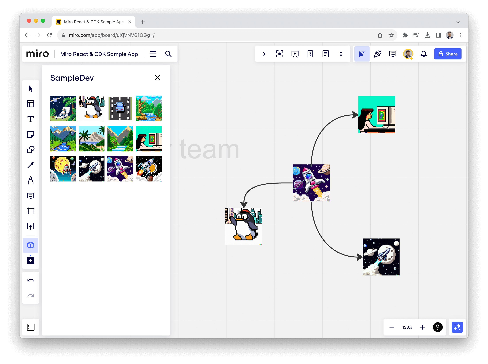
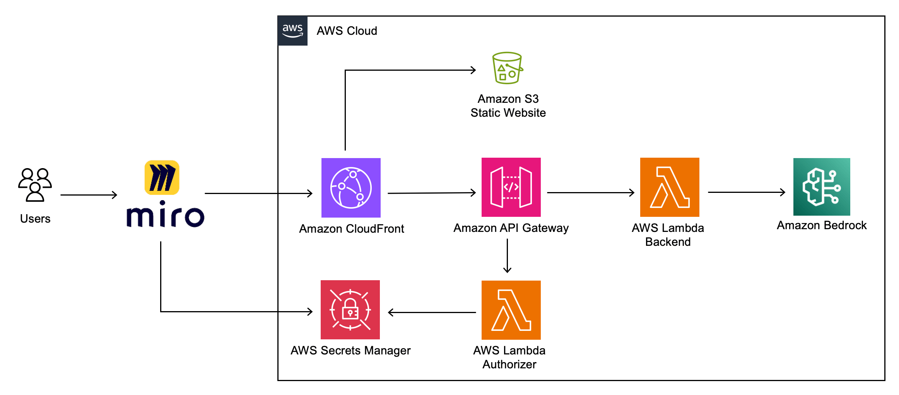
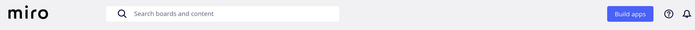
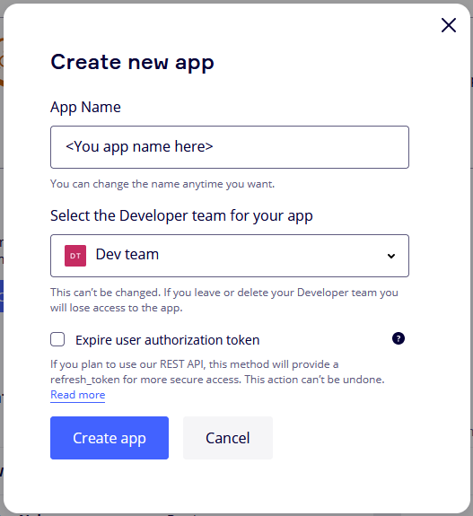
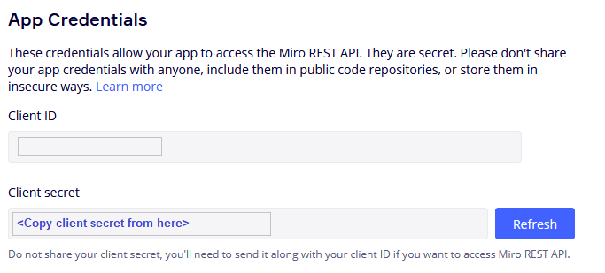
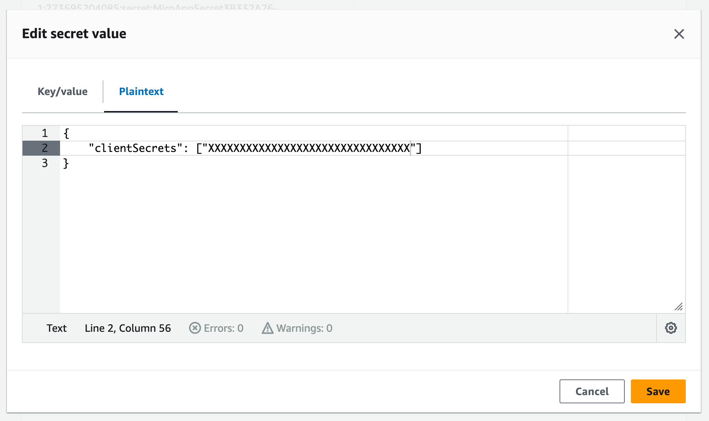
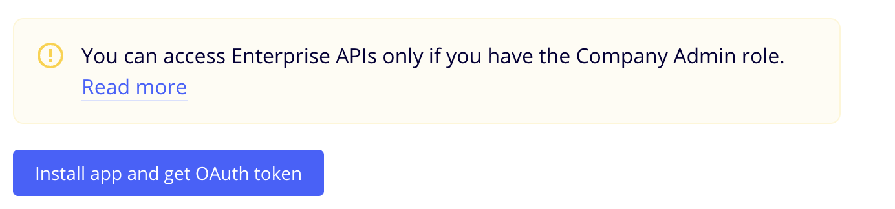
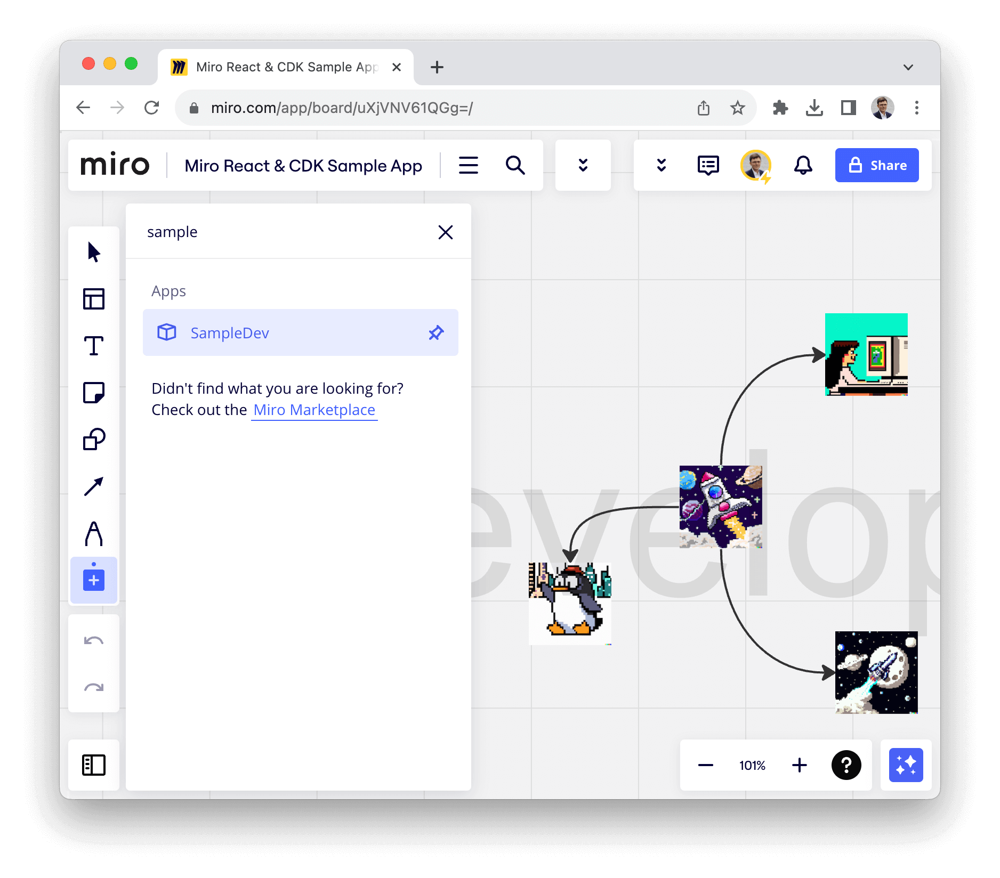

# Deploying Miro React App using AWS CDK
[](https://opensource.org/licenses/MIT)

[](#deploy-with-github-codespaces)



## Table of content
- [Features](#features)
- [Architecture](#architecture)
- [Deploy](#deploy)
  - [With AWS Cloud9](#deploy-with-aws-cloud9)
  - [With GitHub Codespaces](#deploy-with-github-codespaces)
  - [Local deployment](#local-deployment)
  - [Deployment](#deployment)
  - [Create a Miro app](#create-a-miro-app)
- [Local development](#local-development)
- [Clean up](#clean-up)
- [License](#license)


# Features

Before using this sample familiarize yourself with Miro's Developer Platform. Visit the Miro Developer Platform documentation (**[https://developers.miro.com/docs](https://developers.miro.com/docs)**) to learn about the available APIs, SDKs, and other resources that can help you build your app.

This sample demonstrates the deployment of a Miro App on AWS using the AWS Cloud Development Kit (CDK).

It features a React app that enables users to add shapes to the Miro board, take notes on those shapes, and summarize these notes with Amazon Bedrock.

The sample utilizes Amazon CloudFront and Amazon API Gateway with a custom Lambda authorizer that allows the retrieval of Miro user IDs on the backend.

# Architecture




# Deploy

### Environment setup

#### Deploy with AWS Cloud9
We recommend deploying with [AWS Cloud9](https://aws.amazon.com/cloud9/). 
If you'd like to use Cloud9 to deploy the solution, you will need the following before proceeding:
- use `Ubuntu Server 22.04 LTS` as the platform.

#### Deploy with Github Codespaces
If you'd like to use [GitHub Codespaces](https://github.com/features/codespaces) to deploy the solution, you will need the following before proceeding:
1. An [AWS account](https://aws.amazon.com/premiumsupport/knowledge-center/create-and-activate-aws-account/)
2. An [IAM User](https://console.aws.amazon.com/iamv2/home?#/users/create) with:
  - `AdministratorAccess` policy granted to your user (for production, we recommend restricting access as needed)
  - Take note of `Access key` and `Secret access key`.

To get started, click on the button below.

[](https://codespaces.new/aws-samples/miro-react-cdk-sample)

Once in the Codespaces terminal, set up the AWS Credentials by running

```shell
aws configure
```

```shell
AWS Access Key ID [None]: <the access key from the IAM user generated above>
AWS Secret Access Key [None]: <the secret access key from the IAM user generated above>
Default region name: <the region you plan to deploy the solution to>
Default output format: json
```

You are all set for deployment; you can now jump to [deployment](#deployment).

#### Local deployment
If you have decided not to use AWS Cloud9 or GitHub Codespaces, verify that your environment satisfies the following prerequisites:

You have:

1. An [AWS account](https://aws.amazon.com/premiumsupport/knowledge-center/create-and-activate-aws-account/)
2. `AdministratorAccess` policy granted to your AWS account (for production, we recommend restricting access as needed)
3. Both console and programmatic access
4. [NodeJS 18](https://nodejs.org/en/download/) installed
    - If you are using [`nvm`](https://github.com/nvm-sh/nvm) you can run the following before proceeding
    - ```
      nvm install 18 && nvm use 18
      ```
5. [AWS CLI](https://aws.amazon.com/cli/) installed and configured to use with your AWS account
6. [Typescript 3.8+](https://www.typescriptlang.org/download) installed
7. [AWS CDK CLI](https://docs.aws.amazon.com/cdk/latest/guide/getting_started.html) installed
8. [Docker](https://docs.docker.com/get-docker/) installed
   - N.B. [`buildx`](https://github.com/docker/buildx) is also required. For Windows and macOS `buildx` [is included](https://github.com/docker/buildx#windows-and-macos) in [Docker Desktop](https://docs.docker.com/desktop/)

### Deployment

1. Clone the repository
```bash
git clone https://github.com/aws-samples/miro-react-cdk-sample
```
2. Move into the cloned repository
```bash
cd miro-react-cdk-sample
```

<a id="deployment-dependencies-installation"></a>
3. Install the project dependencies by running this command
```bash
npm install
```

4. (Optional) Bootstrap AWS CDK on the target account and region

> **Note**: This is required if you have never used AWS CDK on this account and region combination. ([More information on CDK bootstrapping](https://docs.aws.amazon.com/cdk/latest/guide/cli.html#cli-bootstrap)).

```bash
npx cdk bootstrap aws://{targetAccountId}/{targetRegion}
```

You can now deploy by running:

```bash
npx cdk deploy
```
> **Note**: This step duration can vary greatly, depending on the Constructs you are deploying.

You can view the progress of your CDK deployment in the [CloudFormation console](https://console.aws.amazon.com/cloudformation/home) in the selected region.

5. Once deployed, take note of the `DomainName` and, the `SecretName` that will hold the `Client secret` that you should get from the Miro App.

```bash
...
Outputs:
MiroAppStack.DomainName = https://dxxxxxxxxxxxxx.cloudfront.net
MiroAppStack.SecretName = MiroAppSecretXXXXXXXX-XXXXXXXXXXXX
...
```

### Amazon Bedrock requirements
**Base Models Access**

This sample uses `anthropic.claude-instant-v1` model from Amazon Bedrock in `us-east-1`. You can change the model and the region in `bin/miro-app.ts`.

```typescript
new MiroAppStack(app, "MiroAppStack", {
  bedrockRegion: "us-east-1",
  bedrockModelId: "anthropic.claude-instant-v1",
});
```

You you need to [request access to the base models in one of the regions where Amazon Bedrock is available](https://console.aws.amazon.com/bedrock/home?#/modelaccess). Make sure to read and accept models' end-user license agreements or EULA.

Note:
- You can deploy the solution to a different region from where you requested Base Model access.
- **While the Base Model access approval is instant, it might take several minutes to get access and see the list of models in the UI.**


### Create a Miro app
#### 1. Create [Miro Developer Team](https://developers.miro.com/docs/create-a-developer-team)
💡 If you already have ***Miro Developer Team*** in you account, skip this step.



#### 2. Go to the Miro App management Dashboard (**[https://miro.com/app/settings/user-profile/apps/](https://miro.com/app/settings/user-profile/apps/)**) 
and click `Create new app`. 


Fill in the necessary information about your app, such as its name, select Developer team. Note: you don't need to check the "Expire user authorization token" checkbox. Click `Create app` to create your app.



#### 3. Update App URL

Set `App URL` of the newly created app to the value of `MiroAppStack.DomainName`

#### 4. Update App Permissions

Grant the following permissions to the app.

```
boards:read
boards:write
```

#### 5. Copy client secret on app creation page



#### 6. Add Client secret to AWS Secrets Manager secret
Copy the `Client secret` of newly created app and add it to the AWS Secrets Manager secret `MiroAppStack.SecretName` that you've got on the deployment step. This will authorise the app to call the backend. 

- Go to [AWS Secrets Manager](https://console.aws.amazon.com/secretsmanager/listsecrets)
- Open your secret
- Go to `Secret value`
- Click `Edit` button
- Edit secret as Plaintext

Insert the following JSON into the secret field and save it.

```json
{
  "clientSecrets": ["YOUR_APP_SECRET"]
}
```



#### 7. Install the app to the team



#### 8. Run the App
Return to the Miro Developer Dashboard, click the "More apps" icon on the application bar, locate the app you just installed in the list, and begin working with it.



# Local development
<a id="local-development"></a>
After deployment, to run the application locally, set `VITE_API_BASE` in the `react-app/.env.development` file to the `MiroAppStack.DomainName` you received in the previous stage. For example:

```bash
VITE_API_BASE=https://dxxxxxxxxxxxxx.cloudfront.net
```

This will configure your local version to use the backend hosted in the cloud. Also you now need to create dev app in Miro. 

Create a new app within Miro and set the `App URL` to `http://localhost:3000`.
Grant the following permissions to the app.

```
boards:read
boards:write
```

Copy the `Client secret` of newly created app and add it to the AWS Secrets Manager secret `MiroAppStack.SecretName` that you've got on the deployment step. As a result, the backend will trust both applications.

```json
{
  "clientSecrets": ["PRODUCTION_APP_SECRET", "DEV_APP_SECRET"]
}
```

Now you can run app locally and test it on your Miro board. To run a React app locally, execute the following commands:

```bash
cd react-app
npm run dev
```

# Clean up
You can remove the stacks and all the associated resources created in your AWS account by running the following command:

```bash
npx cdk destroy
```

# License
This library is licensed under the MIT-0 License. See the LICENSE file.

- [Changelog](CHANGELOG.md) of the project.
- [License](LICENSE) of the project.
- [Code of Conduct](CODE_OF_CONDUCT.md) of the project.
- [CONTRIBUTING](CONTRIBUTING.md#security-issue-notifications) for more information.
